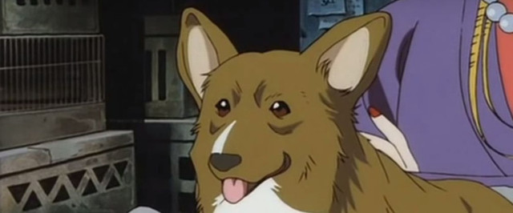

# 𝐌𝐘 𝐑𝐄𝐀𝐃𝐌𝐄

<h3 align="center"> Hello, I'm hednaw. I'm trying to learn Programming and maybe get a job in the industry later.</h3>
  
<h3 align="center"> What I'm currently working on:</h3>

- Learning React 
- Made my first react app - [Catoapo](https://hednaw.github.io/Catoapo)

<kbd></img></kbd>

 <a href="https://www.codewars.com/users/hednaw" >  &nbsp;&nbsp;&nbsp;<a href="https://stackoverflow.com/users/15529003/hednaw" >

**Favorite tools:** 
    

**Skills**: 
   

